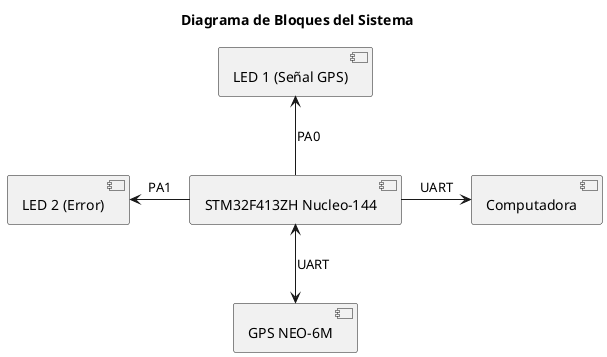

# 🚀 SISTEMA DE MONITOREO DE POSICIÓN GPS CON INDICADORES LED Y COMUNICACIÓN UART 🎯

👩‍🎓 **Alumno:** Karen Tatiana Zamudio Quintero

## 🍩 OBJETIVO:
Desarrollar un sistema que utilice el módulo GPS NEO-6M para obtener datos de posición, mostrar el estado del sistema mediante LEDs y enviar los datos GPS a una computadora a través de UART. ¡Woo-hoo! 🎉

## 📖 DESCRIPCIÓN:
En este proyecto, se utilizará el módulo GPS NEO-6M para obtener datos de posición geográfica en tiempo real. El GPS NEO-6M se conectará a un microcontrolador (STM32F413ZH) mediante comunicación UART. El sistema leerá la información de posición, incluyendo coordenadas de latitud y longitud, y los transmitirá a una computadora para su visualización en el Serial Monitor. Además, se utilizarán LEDs para proporcionar retroalimentación visual sobre el estado del GPS, como la adquisición exitosa de la señal satelital y posibles errores en la recepción de datos. Este módulo GPS será fundamental para obtener datos precisos de ubicación y preparar el sistema para futuras expansiones que incluyan otros sensores y componentes. ¡D'oh! ¡No olvides los LEDs! 💡

## 🔧 MATERIALES: 
1. **Microcontrolador STM32F413ZH Nucleo-144:** Placa de desarrollo con el microcontrolador STM32F413ZH.
2. **Módulo GPS NEO-6M:** Módulo GPS para obtener datos de posición geográfica.
3. **LEDs (varios colores):** LEDs para indicar diferentes estados del sistema (por ejemplo, adquisición de señal GPS, errores, etc.).
4. **Resistencias (220Ω - 330Ω):** Resistencias limitadoras de corriente para los LEDs.
5. **Cables Jumper:** Cables de conexión para establecer las conexiones entre los componentes.
6. **Protoboard:** Protoboard para realizar las conexiones de los componentes de forma ordenada.
7. **Fuente de alimentación:** Fuente de alimentación de 5V para alimentar los componentes, si no se utiliza la alimentación USB.
8. **Computadora:** Computadora para visualizar los datos GPS recibidos mediante la comunicación UART.
9. **Software STM32CubeIDE:** Entorno de desarrollo integrado para programar y depurar el microcontrolador STM32F413ZH.
10. **Conectores y adaptadores necesarios:** Conectores y adaptadores para facilitar la conexión de los componentes (por ejemplo, header pins para la protoboard).

## 📐 DIAGRAMA DE CONEXIONES BÁSICO:
A continuación, se describe el diagrama de conexión del sistema, que incluye el módulo GPS NEO-6M, LEDs y la placa de desarrollo STM32F413ZH Nucleo-144.

1. **Conexión del Módulo GPS NEO-6M al STM32F413ZH:**
    - VCC del GPS al 5V del STM32.
    - GND del GPS al GND del STM32.
    - TX del GPS al pin RX del STM32.
    - RX del GPS al pin TX del STM32 (si se necesita comunicación bidireccional).

2. **Conexión de los LEDs:**
    - **LED 1 (Indicación de señal GPS):**
        - Ánodo del LED a Pin PA0 del STM32.
        - Cátodo del LED a una resistencia de 220Ω.
        - La resistencia se conecta a GND.
    - **LED 2 (Indicación de error):**
        - Ánodo del LED a Pin PA1 del STM32.
        - Cátodo del LED a una resistencia de 220Ω.
        - La resistencia se conecta a GND.

## 📊 DIAGRAMA DE BLOQUES DEL SISTEMA:

A continuación se presenta el diagrama de bloques del sistema:

Este diagrama ilustra la conexión del módulo GPS NEO-6M y los LEDs al microcontrolador STM32F413ZH, utilizando comunicación UART para enviar datos a una computadora.

